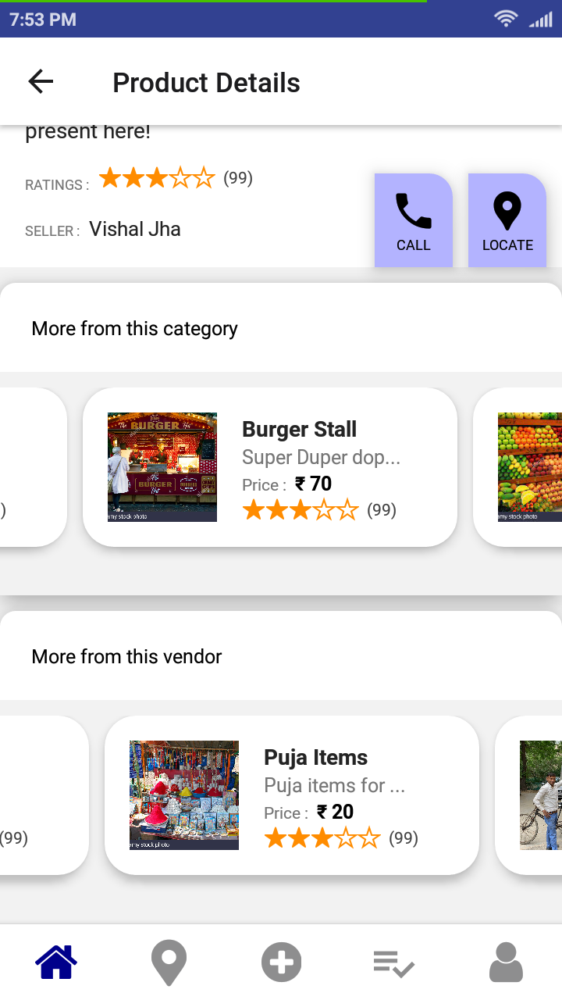

# vHelp

A mobile application which allows users to connect to the local vendors/costermonger and other door steps service providers. The project is completely based upon the Client-Server architecture, where the server and the database are hosted separately and the client communicates via REST APIs.

## User Classifications

There are several types of end users of the application. They are broadly divided as User/Consumers, Vendors and the Administrator. Each of these classes have their own set of features

1. **USER/CONSUMER** who can see all the products (can be filtered by both category wise and the vendor wise), location of products on map (WIP), see the list of all the vendors along with their details and contact them (using thrid party libraries).

2. **VENDOR/COSTERMONGER** who can register on the app and create, delete (created by himself) and edit products along with locations. There products will automatically be added to the list and other users can see them. They can see the products of other vendors as well (for price comparison). Vendor can edit his own details as well.

3. **ADMIN** has the access to all the CRUD operations on all the schemas. They have the ability to delete a user, vendor and product (in case someone reports against any of them).

## Key Features

1. Cross platform mobile application which is designed to run both on android and iOS devices.
2. Each type of user has different types of UI (screens) as per the requirements. These are very userfriendly and anyone can use it. (It uses react-navigation for the navigation across various screens of mobile application)
3. Completely secure application (uses react-redux jwt authentication)
4. Uses redux to store the state of the state of the user in the asyncStorage.
5. Uses multer and cloudinary to upload image on cloud.

## Technology Stack

1. React Native (frontend)
2. Node.js (backend)
3. MongoDB (database)
4. Heroku (backend deployment)

## Project Overview

<table>
  <tr>
    <td>  </td>
    <td> </td>
   </tr> 
   <tr>
      <td></td>
      <td></td>
  </tr>
  <tr>
      <td></td>
      <td></td>
  </tr>
  <tr>
      <td></td>
      <td></td>
  </tr>
  <tr>
      <td></td>
      <td></td>
  </tr>
  <tr>
      <td></td>
      <td></td>
  </tr>
  <tr>
      <td></td>
      <td></td>
  </tr>
</table>

## Future Work

The project is still work in progress and a few fetures (and bugs) needs to be added (priority wise):

1. Live location tracking of vendors on EXPO MAPS.
2. Giving all the relevant access to the admins
3. Adding `Report` option (for users, products, vendors)
4. Dark Mode
